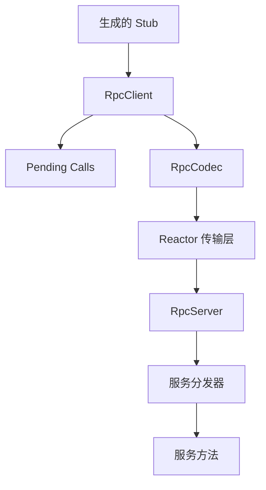

<div align="center">

# AsterRPC

**基于自研 C++17 Reactor 网络库的轻量级异步 RPC 框架**

[设计文档](DESIGN-CN.md) ·
[文档目录](docs/) ·
[快速开始](#快速开始)


</div>

AsterRPC 覆盖了一次 RPC 调用从非阻塞网络 I/O、二进制协议编解码，到服务分发、响应匹配和超时处理的完整链路。

项目旨在通过清晰、可理解的实现，展示现代 C++ RPC 框架背后的网络通信与工程设计。

## 为什么选择 AsterRPC？

- **自研网络层**：基于 `epoll`、Reactor 与非阻塞 I/O 实现，没有直接封装现成的 RPC 网络库。
- **异步请求多路复用**：单条 TCP 连接可以承载多个在途请求，并通过 `request_id` 匹配响应。
- **清晰的模块边界**：网络层、协议层、RPC 层和服务发现相互解耦，便于理解与扩展。
- **完整的可靠性处理**：支持超时、Deadline、断连清理和基于幂等语义的失败重试。
- **可观测的运行状态**：通过异步日志和 Metrics 统计请求量、错误数与调用延迟。

## 核心功能

| 分类 | 功能 | 状态 |
|---|---|:---:|
| 网络层 | 基于 `epoll` 的 Reactor 与非阻塞 TCP | ✅ |
| 网络层 | 连接级输入、输出缓冲区 | ✅ |
| 协议层 | 自定义二进制 RPC 协议 | ✅ |
| 序列化 | Protobuf 消息序列化 | ✅ |
| 客户端 | 同步与异步 RPC 调用 | ✅ |
| 客户端 | 请求多路复用与响应匹配 | ✅ |
| 可靠性 | Timeout 与 Deadline 处理 | ✅ |
| 可靠性 | 基于幂等语义的失败重试 | ✅ |
| 连接管理 | 连接池 | ✅ |
| 可观测性 | 异步日志与运行时 Metrics | ✅ |
| 服务发现 | 可选的 ZooKeeper 服务注册与发现 | ✅ |
| 负载均衡 | Round Robin | ✅ |
| 负载均衡 | P2C-EWMA | ✅ |
| 可靠性 | 主动健康检查与熔断 | 📋 |

> ✅ 已实现　·　🚧 开发中　·　📋 计划中

## 系统架构



项目将传输层、协议层和 RPC 层进行解耦：

```text
应用层      Stub / Service 实现
RPC 层      RpcClient / RpcServer / PendingCalls / ServiceDispatcher
协议层      RpcMessage / RpcCodec / Protobuf
传输层      TcpConnection / Buffer / Channel / EventLoop
系统层      epoll / eventfd / timerfd / non-blocking sockets
```

完整的请求生命周期、线程模型和对象所有权设计，请阅读 [设计文档](DESIGN-CN.md)。

## 快速开始

### 环境要求

- Linux
- CMake 3.22+
- 支持 C++17 的 GCC 或 Clang
- Git

> 如果系统中没有安装 Protobuf，CMake 会自动下载并编译，
> 因此首次构建需要网络连接，耗时也会更长。

### 构建

```bash
git clone https://github.com/zthinedge/AsterRPC.git
cd AsterRPC

cmake -S . -B build -DCMAKE_BUILD_TYPE=Release
cmake --build build -j$(nproc)

```
### 运行 Calculator 示例

启动服务端：

```bash
./build/calculator_server
```

打开另一个终端，运行客户端：

```bash
./build/calculator_client
```

### 运行测试

```bash
ctest --test-dir build --output-on-failure
```

### 启用 ZooKeeper

ZooKeeper 集成为可选功能，默认关闭：

```bash
cmake -S . -B build \
  -DCMAKE_BUILD_TYPE=Release \
  -DMINIRPC_WITH_ZOOKEEPER=ON

cmake --build build -j
```

然后运行：

```bash
./build/registry_server
./build/registry_client
```

## RPC 调用链

```text
调用 Stub 方法
  → RpcClient 创建请求并注册 PendingCall
  → RpcCodec 序列化消息
