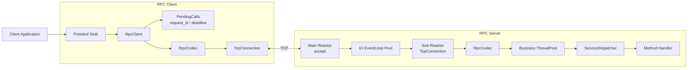

# AsterRPC

AsterRPC 是基于 C++17 和 Linux Reactor 模型实现的轻量级 Unary RPC 框架。
客户端直接连接服务端地址，项目聚焦网络、协议和 RPC 调用主链路，不包含注册
中心、集群治理、链路追踪和 HTTP 网关。

## 架构



一次调用的主链路：

```text
Protobuf Request
  -> RpcClient / request_id / PendingCalls / Deadline
  -> RpcCodec Encode -> TcpConnection
  -> RpcServer Decode -> Business ThreadPool
  -> ServiceDispatcher -> Method Handler
  -> Response -> PendingCalls Complete
  -> Future or Callback
```

## 核心能力

- 基于 `epoll` 的主从 Reactor，支持多 IO 线程和 `eventfd` 跨线程唤醒。
- 使用 `timerfd` 管理 RPC Deadline。
- 固定 24 字节 Header + Meta + Payload 二进制协议。
- 增量解码 TCP 半包、粘包、连续帧和非法帧。
- 基于 `request_id -> PendingCall` 实现单连接并发复用与乱序响应匹配。
- 提供同步、Future、Callback 三种调用接口。
- 使用有界业务线程池隔离网络 IO 和方法执行。
- 使用 Protobuf 完成业务对象序列化。

## 项目结构

```text
include/asterrpc/net       Reactor、连接、Buffer、定时器
include/asterrpc/protocol  Header、Meta、Message、Codec
include/asterrpc/rpc       Client、Server、PendingCalls、Dispatcher
include/asterrpc/common    有界业务线程池
examples                   Calculator Protobuf 示例
benchmarks                 RPC Benchmark
tests                      网络、协议和 RPC 测试
docs                       网络、协议和性能文档
```

## 快速开始

环境要求：Linux、C++17、CMake 3.22+、Protobuf。

Ubuntu 安装依赖：

```bash
sudo apt-get update
sudo apt-get install --yes \
  build-essential cmake git \
  libprotobuf-dev protobuf-compiler
```

构建并运行测试：

```bash
git clone https://github.com/zthinedge/AsterRPC.git
cd AsterRPC
cmake -S . -B build-simple -DCMAKE_BUILD_TYPE=Release
cmake --build build-simple -j"$(nproc)"
ctest --test-dir build-simple --output-on-failure
```

如果系统没有 Protobuf，CMake 会通过 `FetchContent` 下载并构建 Protobuf v35.0，
首次构建会更慢。

## Calculator 示例

终端一启动服务端：

```bash
./build-simple/calculator_server 9000 \
  --io-threads 4 \
  --business-threads 4 \
  --business-queue 65536
```

终端二启动交互式客户端：

```bash
./build-simple/calculator_client 127.0.0.1 9000
```

也可以执行一次调用：

```bash
./build-simple/calculator_client 127.0.0.1 9000 20 22
```

## Benchmark

服务端同时注册了 `BenchService.Echo`。启动服务端后运行：

```bash
./build-simple/rpc_benchmark \
  --host 127.0.0.1 \
  --port 9000 \
  --connections 4 \
  --concurrency 200 \
  --requests 100000 \
  --payload-bytes 1024 \
  --deadline-ms 1000
```

`connections` 是 TCP 连接数；`concurrency` 是所有连接合计的未完成 RPC 数量，
不代表线程数。测试方法、参数解释和基线结果见
[Benchmark 文档](docs/BENCHMARK.md)。

## 测试与 CI

CTest 覆盖 Socket、Buffer、Connector、EventLoop、IO 线程池、业务线程池、协议
编解码和 RPC 主链路。GitHub Actions 在 push、Pull Request 和手动触发时执行
Debug 构建及全部测试，配置见 [CI 工作流](.github/workflows/ci.yml)。

## 文档

- [网络模型](docs/NETWORK.md)
- [RPC 协议](docs/PROTOCOL.md)
- [性能基线](docs/BENCHMARK.md)
